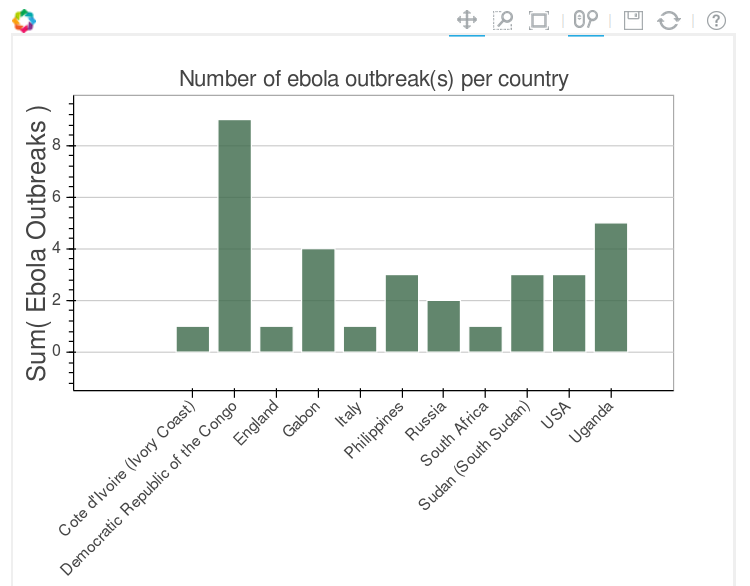
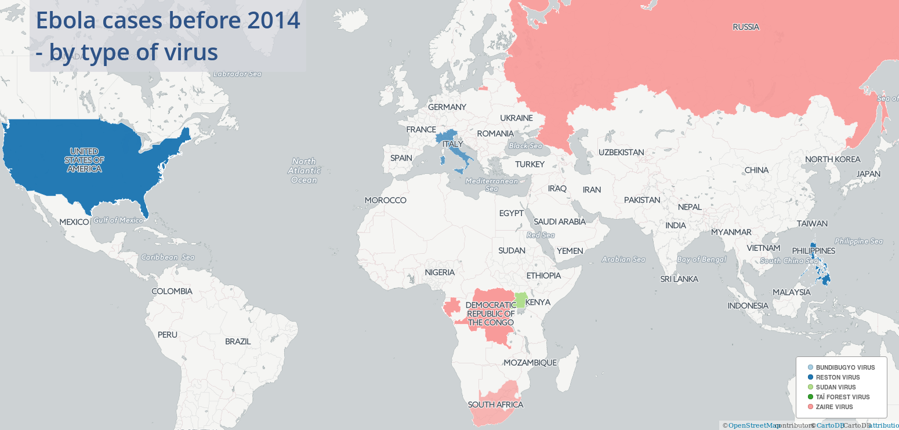

## Humanitarian data analysis - Ebola outbreaks

#### Data source:

CSV of Ebola outbreaks before 2014 from the humanitarian data exchange (HDX).
See [here](https://data.hdx.rwlabs.org/dataset/ebola-outbreaks-before-2014)

#### Visualisation:

* Exploring the data set with Pandas and Bokeh. [Notebook](https://github.com/Eleonore9/ebola_outbreaks/blob/master/6_exploring_the_dataset.ipynb)

* [Cartodb map](https://eleo.cartodb.com/viz/eb27aace-9475-11e5-b6d6-0ecd1babdde5/public_map)

#### Tools:
Python, Jupyter notebook, Pandas, GeoPandas, GeoPy + cartodb

#### Fixing/adding info:

* Get the date range into a start date and en date. [Notebook](https://github.com/Eleonore9/ebola_outbreaks/blob/master/1_format_dates_add_duration.ipynb)

* Get countries 2 letters ISO code. [Notebook](https://github.com/Eleonore9/ebola_outbreaks/blob/master/2_add_iso_countries_codes.ipynb)

* Add coordinates using GeoPy. [Notebook](https://github.com/Eleonore9/ebola_outbreaks/blob/master/3_add_coordinates.ipynb)

* Add geometry. [Notebook](https://github.com/Eleonore9/ebola_outbreaks/blob/master/4_add_geometry.ipynb)

#### Other:
* Geocoding with GeoPy + plotting with Geoplotlib and Folium. [Notebook](https://github.com/Eleonore9/ebola_outbreaks/blob/master/geopy_geoplotlib_folium.ipynb)

